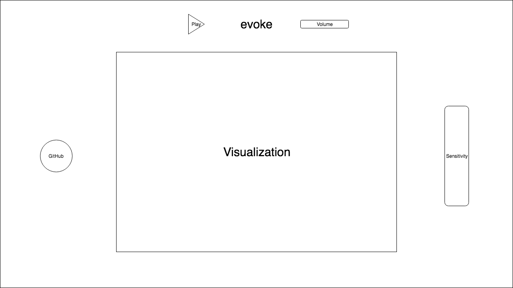

# evoke

## Overview
evoke is a dynamic music visualizer created using the SoundJS, the Web Audio API, and Three.js. evoke will analyze the frequency, amplitude, time, and other aspects of the input signal using the Web Audio API, and reactively draw and transform SVG based on this data taken from the signal using Three.js.

Users will be able to alter aspects of the visualization such as sensitivity, etc.

## Functionality

In evoke, users will be able to:

- [ ] Select a local music file to be parsed
- [ ] Alter the sensitivity of the visualizations
- [ ] Choose a color scheme for the visualizations

## Wireframes

evoke will consist of a single screen with the visualization canvas, with the visualization in the center of the screen.

To the top, a play/pause button for the music and a slider for volume. To the right, a slider for the sensitivity of the visualization. And to the left, a link to my GitHub will be included.

## Technologies

evoke will utilize the following technologies:

- `SoundJS` and the `Web Audio API` for easy, accessible audio manipulation and analysis
- `Three.js` library to implement the visualizations

## Implementation Timeline

### Weekend:
Finish basic setup and research

- [x] Complete SoundJS, Web Audio API, and Three.js tutorials
- [x] Write proposal README

### Day 1:
Start project and basic functionality
- [ ] Implement music file parsing
- [ ] Analyze data obtained using Three.js

### Day 2:
Learn to dynamically draw
- [ ] Continue learning Three.
- [ ] Dynamically draw using Three
- [ ] Implement color schemes

### Day 3:
Implement QoL features
- [ ] Continue learning Three.
- [ ] Design visual effects
- [ ] Implement play/pause button
- [ ] Implement sensitivity slider

### Day 4:
Finish up last minute touches and UX
- [ ] Continue learning Three.
- [ ] Add more visual effects
- [ ] Check CPU load while running

## Bonus features
- [ ] Add more visualization modes
- [ ] Add integration for SoundCloud and Spotify
- [ ] Implement audio modulation