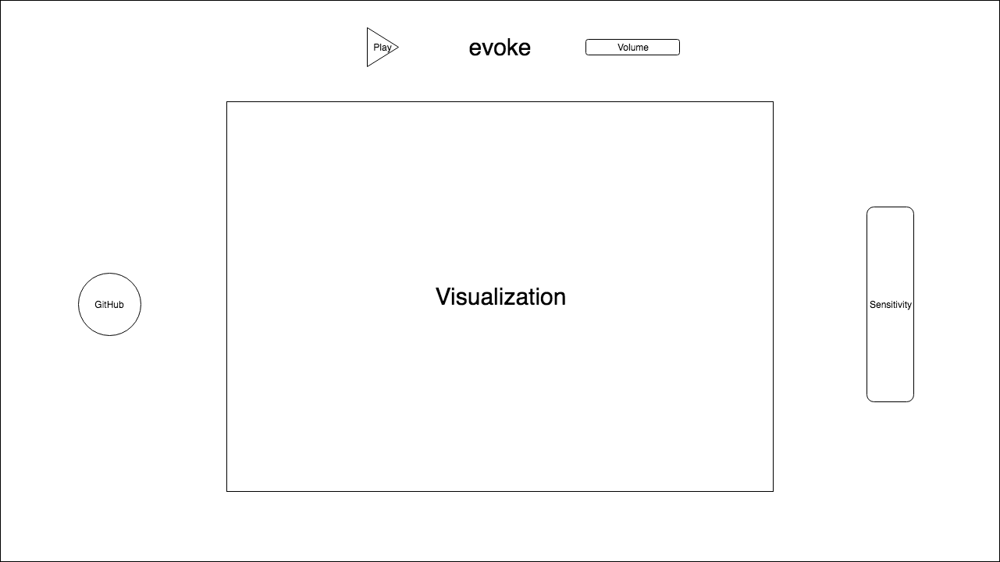

# conjure

## Overview
conjure is a dynamic music visualizer created using p5.js. conjure will analyze the frequency, amplitude, time, and other aspects of the input signal, and reactively draw and transform based on this data taken from the signal using p5.js.

Users will be able to alter aspects of the visualization such as sensitivity, etc.

## Functionality

In conjure, users will be able to:

- [ ] Select a local music file to be parsed
- [ ] Alter the sensitivity of the visualizations
- [ ] Choose a color scheme for the visualizations

## Wireframes

conjure will consist of a single screen with the visualization canvas, with the visualization in the center of the screen.

To the top, a play/pause button for the music and a slider for volume. To the right, a slider for the sensitivity of the visualization. And to the left, a link to my GitHub will be included.

## Technologies

conjure will utilize the following technologies:

- `p5.js` library to implement the visualizations

## Implementation Timeline

### Weekend:
Finish basic setup and research

- [x] Complete p5.js tutorials
- [x] Write proposal README

### Day 1:
Start project and basic functionality
- [x] Implement music file parsing
- [x] Analyze data obtained using p5.js

### Day 2:
Learn to dynamically draw
- [x] Continue learning p5
- [x] Dynamically draw using p5
- [ ] Implement color schemes

### Day 3:
Implement QoL features
- [ ] Continue learning p5
- [ ] Design visual effects
- [ ] Implement play/pause button
- [ ] Implement sensitivity slider

### Day 4:
Finish up last minute touches and UX
- [ ] Continue learning p5
- [ ] Add more visual effects
- [ ] Check CPU load while running

## Bonus features
- [ ] Add more visualization modes
- [ ] Add integration for SoundCloud and Spotify
- [ ] Implement audio modulation